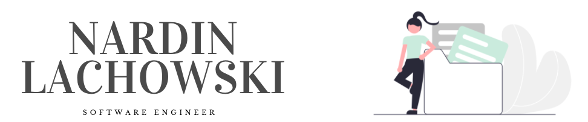

- 🔭  I’m currently working on: [Facebook Clone](https://github.com/nard1n/facebook-clone)
- 🌱  I’m learning: Python
- 📫  How to reach me: nardin,lachowski@gmail.com
- 👩‍💻  Technologies I use: JavaScript, React.js, Redux, Node.js, HTML/CSS, NoSQL, SQL, Express.js, REST API, Next.js
- 💫  Fun fact: I am multilingual, a podcast junkie, and like my coffee cold
